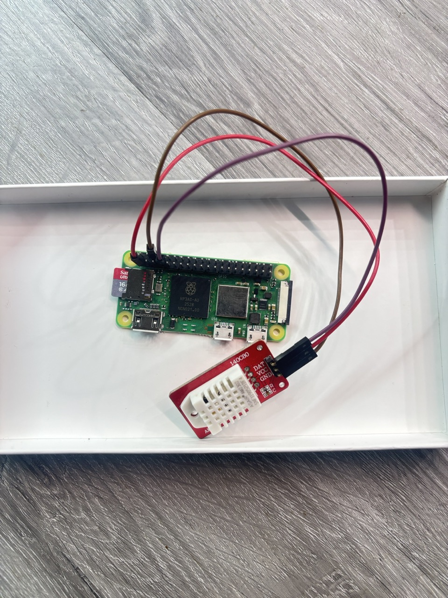

# DHT Prometheus Exporter

[](https://go.dev/)
[](https://goreportcard.com/report/github.com/guivin/dht-prometheus-exporter)
[](LICENSE)
[](https://github.com/guivin/dht-prometheus-exporter/releases)
[](https://github.com/guivin/dht-prometheus-exporter/issues)

<p align="center">
  
</p>

> A Prometheus exporter for DHT22/AM2302 temperature and humidity sensors designed for Raspberry Pi
g
This repository contains a production-ready Prometheus exporter for the DHT22/AM2302 temperature and humidity sensors, optimized
for use on Raspberry Pi devices. Built with Go, it provides reliable metrics collection with proper error handling and retry logic.

## Prerequisites

Before you begin, ensure you have the necessary tools and dependencies installed:

* **Go 1.16 or later**: Required for building the project with Go modules:

```bash
sudo apt-get install golang
```

* **Make**: Required for building the source code:

```bash
sudo apt install make
```

## Installation

Follow these steps to install the DHT Prometheus Exporter on your Raspberry Pi:

1. Clone the repository:

```bash
git clone https://github.com/guivin/dht-prometheus-exporter.git
cd dht-prometheus-exporter
```

2. Build the project:

```bash
make build
```

Or build manually:

```bash
go build -o dht-prometheus-exporter ./cmd/dht-prometheus-exporter
```

3. Install the binary (optional):

```bash
make install
```

4. Create a dedicated system user that belongs to the gpio group (for GPIO pin access):

```
useradd --user-group --groups gpio --no-create-home --system --shell /usr/sbin/nologin dht-prometheus-exporter
```

5. Set up the configuration file. Copy the example configuration file and modify it according to your needs:

```bash
sudo cp examples/dht-prometheus-exporter.yml /etc/dht-prometheus-exporter.yml
sudo chown dht-prometheus-exporter:dht-prometheus-exporter /etc/dht-prometheus-exporter.yml
sudo chmod 0640 /etc/dht-prometheus-exporter.yml
```

Edit `/etc/dht-prometheus-exporter.yml` to configure:
- `name`: Sensor name for metrics labels
- `gpio_pin`: GPIO pin number where DHT22 is connected
- `max_retries`: Number of retry attempts for sensor reads
- `listen_port`: HTTP port for metrics endpoint (default: 8080)
- `log_level`: Logging level (debug, info, warn, error)
- `temperature_unit`: celsius or fahrenheit

6. Integrate with systemd for easy service management:

```bash
sudo cp examples/dht-prometheus-exporter.service /etc/systemd/system
sudo systemctl daemon-reload
sudo systemctl enable dht-prometheus-exporter
sudo systemctl start dht-prometheus-exporter
```

Check service status:

```bash
sudo systemctl status dht-prometheus-exporter
```

## Usage

### HTTP Endpoints

The exporter exposes the following HTTP endpoints:

| Endpoint | Description |
|----------|-------------|
| `/metrics` | Prometheus metrics endpoint |
| `/health` | Health check endpoint (returns 200 OK) |
| `/ready` | Readiness check endpoint (returns 200 OK) |

Retrieve the metrics from the exporter by querying the designated HTTP endpoint (adjust the port if
your configuration differs):

```bash
curl http://localhost:8080/metrics
```

This command will output the current readings from your DHT22/AM2302 sensors, making the data available for Prometheus
scraping and subsequent analysis or visualization.

### Prometheus Configuration

Add the following to your `prometheus.yml` to scrape metrics from the exporter:

```yaml
scrape_configs:
  - job_name: 'dht'
    static_configs:
      - targets: ['raspberry-pi:8080']
    scrape_interval: 30s
```

### Exposed Metrics

| Metric | Type | Description | Labels |
|--------|------|-------------|--------|
| `dht_temperature_degree` | Gauge | Current temperature reading | `dht_name`, `hostname`, `gpio`, `unit` |
| `dht_humidity_percent` | Gauge | Current humidity reading | `dht_name`, `hostname`, `gpio` |

## Testing

Run the test suite:

```bash
make test
```

Generate test coverage report:

```bash
make test-coverage
```

This will create `coverage.html` that you can open in a browser to see detailed coverage information.

## Development

### Project Structure

The project follows standard Go conventions:

```
dht-prometheus-exporter/
├── cmd/
│   └── dht-prometheus-exporter/    # Application entry point
├── internal/                        # Internal packages
│   ├── config/                      # Configuration management
│   ├── sensor/                      # DHT sensor interface and implementation
│   ├── collector/                   # Prometheus collector
│   └── logger/                      # Logging configuration
├── examples/                        # Example configuration files
│   ├── dht-prometheus-exporter.yml # Example config file
│   └── dht-prometheus-exporter.service # Example systemd service
├── testdata/                        # Test data files
├── go.mod                           # Go module definition
└── Makefile                         # Build automation
```

### Building from Source

```bash
# Build the binary
make build

# Run tests
make test

# Clean build artifacts
make clean

# Tidy Go modules
make mod-tidy
```

## Troubleshooting

### Permission Denied on GPIO

If you see "permission denied" errors when accessing GPIO pins:

```bash
# Ensure the user running the exporter is in the gpio group
sudo usermod -a -G gpio dht-prometheus-exporter

# Restart the service
sudo systemctl restart dht-prometheus-exporter
```

### Sensor Read Failures

DHT22 sensors can occasionally fail to read. The exporter has built-in retry logic controlled by `max_retries` in the configuration. If you see frequent failures:

1. Check the wiring connections between the Raspberry Pi and the DHT22 sensor
2. Ensure proper pull-up resistor (4.7k-10k ohm) on the data line
3. Increase `max_retries` in the configuration
4. Check the sensor is receiving proper 3.3V power

### Service Not Starting

Check the service logs for errors:

```bash
sudo journalctl -u dht-prometheus-exporter -f
```

Common issues:
- Configuration file not found or invalid YAML
- Port already in use (change `listen_port` in config)
- Missing GPIO permissions

### No Metrics Returned

If `/metrics` returns no DHT metrics:

1. Verify the sensor is properly connected
2. Check GPIO pin number matches your wiring
3. Review logs for sensor read errors
4. Test with debug log level: set `log_level: debug` in config
